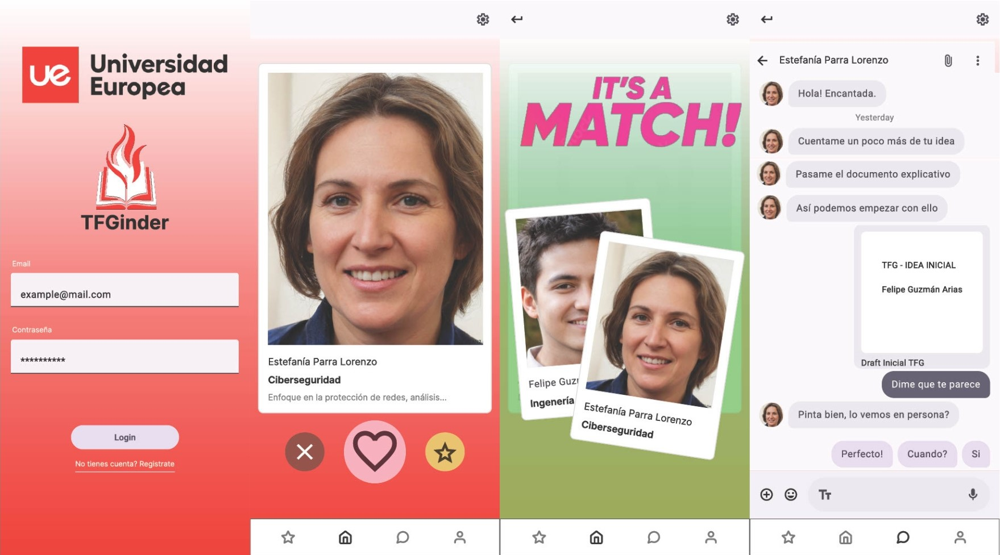

# TFGinder

## Descripción

TFGinder es una aplicación diseñada para conectar alumnos con profesores tutores para el Trabajo de Fin de Grado (TFG). El enfoque es similar a una aplicación de "match", donde tanto alumnos como profesores pueden expresar interés mutuo y comenzar a trabajar juntos en el desarrollo del TFG. Los alumnos pueden proponer varias ideas de TFG, especialmente si están cursando un doble grado, y buscar un profesor que encaje con sus necesidades.

## Funcionalidades

- **Registro de usuarios**: Los alumnos y profesores pueden registrarse en la plataforma.
- **Búsqueda de profesores**: Los alumnos pueden explorar perfiles de profesores basados en sus intereses y especializaciones.
- **Match**: Alumnos y profesores pueden hacer "match" si ambos muestran interés.
- **Gestión de ideas de TFG**: Los alumnos pueden proponer varias ideas de TFG y gestionarlas desde su perfil.
- **Favoritos**: Los alumnos pueden agregar profesores a una lista de favoritos para revisar más tarde.
- **Chat**: Una vez que se hace match, los alumnos y profesores pueden conversar a través del chat integrado.

## Tecnologías utilizadas

- **Angular y TypeScript**: Para la estructura del frontend y la interacción con el usuario.
- **Ionic Framework**: Para la creación de la interfaz.
- **HTML y CSS**: Para estructurar y estilizar el contenido de la aplicación.
- **Firebase o base de datos**: Para almacenar información sobre los profesores, alumnos, y las conversaciones de chat.
- **Git y GitHub**: Control de versiones.

## Por implementar

- **Registro de usuarios**: Crear el sistema de registro de alumnos y profesores con validación de datos (nombre, correo, contraseña).
- **Login y autenticación**: Implementar un sistema de login y autenticación para gestionar el acceso de los usuarios.
- **Gestión de favoritos**: Almacenar y gestionar los profesores marcados como favoritos por los alumnos en Firebase.
- **Mejora del chat**: Optimización de la funcionalidad de chat, permitiendo el envío de documentos relacionados con el TFG.
- **Filtros avanzados de profesores**: Permitir a los alumnos buscar y filtrar profesores según especialización, disponibilidad, y calificaciones previas.
- **Notificaciones**: Implementar un sistema de notificaciones que avise a los usuarios cuando reciban un mensaje nuevo o cuando se haga un match.
- **Optimización de la base de datos**: Mejorar la estructura de la base de datos para que soporte la búsqueda eficiente de profesores y la gestión de las propuestas de TFG.
- **Validación de formularios**: Añadir validación a los formularios de registro para verificar campos como email y contraseñas.
- **Autenticación de usuarios**: Terminar la implementación de un sistema de login seguro con Firebase Authentication o cualquier otro servicio de autenticación.
- **Gestión de propuestas de TFG**: Mejorar la lógica de creación, edición y eliminación de las ideas de TFG para que los alumnos puedan gestionarlas correctamente.
- **Interfaz de administración para profesores**: Crear una vista donde los profesores puedan ver los alumnos interesados y gestionar las solicitudes de TFG.
- **Sistema de calificación**: Implementar un sistema que permita a los alumnos evaluar la experiencia con el profesor al finalizar el TFG.

## Imágen del prototipo inicial

## Prototipo interactivo

El prototipo de la aplicación, donde se puede explorar la navegación y diseño de la interfaz, se encuentra en la rama `figma-prototype`. 

### ¿Cómo acceder al prototipo?

1. En GitHub, selecciona la rama `figma-prototype` desde el selector de ramas (branch) en la parte superior izquierda.
2. Una vez en la rama, podrás ver el README que contiene capturas de pantalla y el enlace al prototipo interactivo en Figma.

[Enlace directo al prototipo en Figma](https://www.figma.com/proto/mD6poSQISxMKhh0NFjWK5a/AppDesign?node-id=1-33&node-type=canvas&t=fCv52QfU8z2E5Cl1-1&scaling=scale-down&content-scaling=fixed&page-id=0%3A1&starting-point-node-id=1%3A33)
