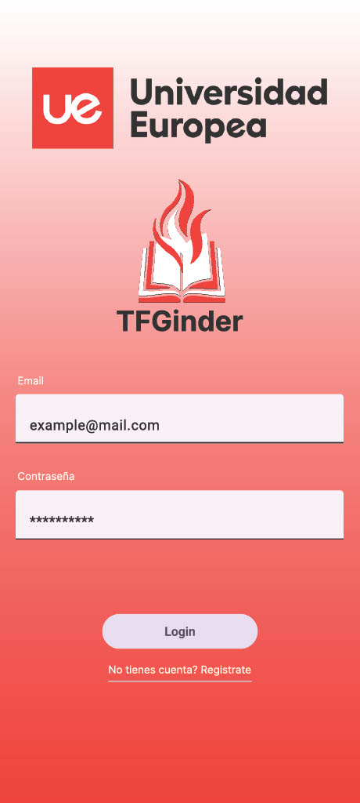

## Prototipo de la Aplicación

Este prototipo en Figma presenta una vista previa interactiva de la aplicación de TFGinder.

El prototipo incluye todas las pantallas clave de la aplicación, desde el registro y la creación de perfiles, hasta la función de "match" entre alumnos y profesores, y la comunicación directa a través del chat. 

Los usuarios pueden interactuar con el flujo de navegación para ver cómo se realizaría la selección de profesores desde el [prototipo interactivo](https://www.figma.com/proto/mD6poSQISxMKhh0NFjWK5a/AppDesign?node-id=1-33&node-type=canvas&t=fCv52QfU8z2E5Cl1-1&scaling=scale-down&content-scaling=fixed&page-id=0%3A1&starting-point-node-id=1%3A33).

## Pantalla de Login

La pantalla de **Login** permite a los usuarios registrados acceder a la aplicación introduciendo sus datos. Si un usuario aún no tiene una cuenta, puede registrarse haciendo click en la parte designada de la pantalla, en la parte inferior. La pantalla está diseñada para que tanto profesores como alumnos puedan iniciar sesión en la plataforma y acceder a sus respectivas funcionalidades.

## Pantalla de Registro

### Selección de tipo de usuario

La pantalla de **Selección de tipo de usuario** permite a los usuarios elegir si quieren registrarse como **Profesor** o **Estudiante**. Dependiendo de la selección, el usuario es redirigido a un formulario específico de registro.

### Registro de Estudiantes

El formulario de **Registro de Estudiantes** permite a los alumnos ingresar su información, incluyendo nombre, correo electrónico, y contraseña, además de seleccionar el grado académico en el que están matriculados.

### Registro de Profesores

El formulario de **Registro de Profesores** solicita la información del profesor, incluyendo nombre, correo electrónico, contraseña y especialidad. Esto permite a los alumnos encontrar a los profesores basados en sus áreas de experiencia.

## Pantalla Principal

La **pantalla principal** muestra los perfiles de los profesores que el alumno puede seleccionar para su TFG. Cada perfil incluye el nombre del profesor, su especialidad, y un breve resumen de su experiencia. El alumno puede deslizar hacia la izquierda para descartar un profesor, hacer clic en el ícono del corazón para indicar que le interesa, o agregar el perfil a favoritos para considerarlo más adelante.

## Detalle del Perfil del Profesor

La pantalla de **detalle del perfil del profesor** muestra información más detallada sobre el profesor seleccionado. Incluye su nombre, su especialización y la descripción de su experiencia. Además, se destacan los intereses del profesor en forma de etiquetas, lo que permite a los alumnos ver si el profesor tiene experiencia en áreas relevantes para su TFG.

## Pantalla de Match

La pantalla de **match** confirma que tanto el alumno como el profesor han mostrado interés mutuo. Cuando ambos seleccionan "me gusta", se muestra un mensaje de "¡It's a match!" junto con las fotos del alumno y el profesor, indicando que ahora pueden comenzar a trabajar juntos en el TFG.

## Pantalla de Profesores Favoritos

La pantalla de **profesores favoritos** permite a los alumnos ver una lista de los profesores que han marcado como favoritos durante el proceso de selección. Esta sección facilita que los alumnos vuelvan a consultar los profesores que les interesan para tomar una decisión final.

## Pantalla de Perfil del Estudiante

La pantalla de **perfil del estudiante** muestra la información personal del alumno, incluyendo su nombre, carrera y correo electrónico. Además, se presentan las ideas de TFG que el alumno ha propuesto, con la opción de agregar nuevos TFGs. Los alumnos que cursan un doble grado pueden proponer varias ideas de TFG.

## Pantalla de Chats

La pantalla de **chats** muestra una lista de las conversaciones activas que el alumno ha iniciado con los profesores. También se indica si hay mensajes sin leer.

## Pantalla de Conversación

La **pantalla de conversación** permite a los alumnos y profesores intercambiar mensajes una vez que han hecho match. En esta pantalla, el alumno y el profesor pueden discutir detalles sobre el TFG, compartir documentos e ideas, y coordinar el trabajo del proyecto. Los usuarios también pueden enviar documentos relevantes para el TFG directamente en el chat.
